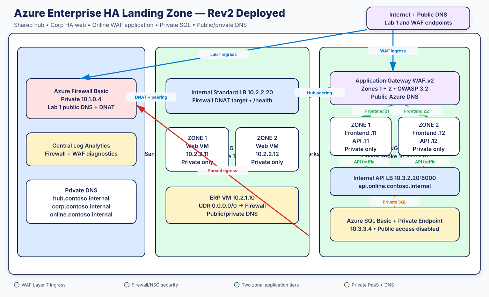
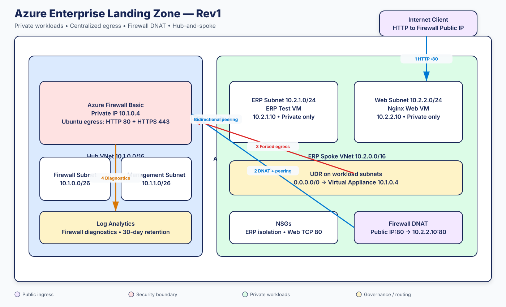

# Azure Enterprise HA Landing Zone — Rev2

Start with the complete [Low-Level Design and Fresh-Sandbox Deployment Guide](docs/LLD-FRESH-SANDBOX-DEPLOYMENT-GUIDE.md). It covers Lab 0 remote-state bootstrap, Portal-first learning, Terraform deployment, DNS, WAF, SQL interaction, HA testing, troubleshooting and cleanup.

> **Status:** Labs 1 and 4 are implemented and Azure-validated. Lab 9 governance
> remains capability-gated by tenant and management-group permissions.

## What Rev2 contains today

The distinction below is important: an architecture diagram is not proof that
Terraform for that component exists.

| Component | Terraform status | Azure status |
|---|---|---|
| Hub, firewall, Corp spoke and ERP VM | Implemented | Azure validated |
| Rev2 Section 1 — ALZ hierarchy | Design/code reference only | Not deployed |
| Rev2 Section 1 — two zonal web VMs and internal LB | Implemented | Azure validated, including failover |
| Rev2 Section 1 — public/private DNS | Implemented | Azure validated |
| Rev2 Section 4 — Online spoke, WAF_v2, four zonal VMs, private SQL and DNS | Implemented | Azure validated, including WAF, data and failover tests |
| Rev2 Section 4 — DDoS IP Protection | Capability-gated plan | Not deployed |
| Rev2 Section 9 — policy/RBAC guardrails | Partial reference in `policy.tf.disabled` | Not deployed due to sandbox permissions |
| Rev2 Section 9 — GitHub drift workflow | Planned | Not configured |

Running Terraform from the repository root deploys the Corp and Online landing
zone lab resources. See [Lab 4 runbook](docs/LAB4-WAF-ONLINE-RUNBOOK.md) for the
application, DNS, portal, Terraform and validation workflows.

## Rev2 curriculum sections

| Section | Name | Primary outcome | Details |
|---|---|---|---|
| Rev2 Section 1 | ALZ and Multi-Zone HA Foundation | Landing-zone model plus two zonal web VMs behind an internal Standard Load Balancer | [Section 1](sections/rev2-section-01-alz-ha/README.md) |
| Rev2 Section 4 | WAF and DDoS Secure Ingress | Application Gateway WAF_v2, OWASP/custom rules, secure private backends | [Section 4](sections/rev2-section-04-waf-ddos/README.md) |
| Rev2 Section 9 | Governance and Drift Control | Policy initiative, group-based RBAC, exemptions, diagnostics and drift detection | [Section 9](sections/rev2-section-09-governance-drift/README.md) |

The cross-section status dashboard is in
[IMPLEMENTATION-STATUS.md](docs/IMPLEMENTATION-STATUS.md).

Terraform lab implementing a restricted-sandbox version of an Azure Corp
application landing zone. It demonstrates centralized egress inspection, private
workload VMs, hub-and-spoke routing, Azure Firewall DNAT, and centralized logs.

The active sandbox design deploys into one pre-created resource group because the
training identity cannot create resource groups or subscription-level policies.
The network and security behavior remains representative of an enterprise landing
zone.

## Rev2 target architecture

[](docs/diagrams/architecture-rev2.svg)

Edit the source at [excalidraw.com](https://excalidraw.com):
[architecture-rev2.excalidraw](docs/diagrams/architecture-rev2.excalidraw).

The current Rev1 deployment diagram remains available for baseline comparison:
[Rev1 SVG](docs/diagrams/architecture-rev1.svg) and
[Rev1 Excalidraw source](docs/diagrams/architecture-rev1.excalidraw).

See [REV2-IMPLEMENTATION-PLAN.md](docs/REV2-IMPLEMENTATION-PLAN.md) for the
staged architecture decisions, sandbox capability gates, address plan, and test
matrix.

## Current Rev1 baseline architecture

[](docs/diagrams/architecture-rev1.svg)

The source is editable in [Excalidraw](https://excalidraw.com):
[architecture-rev1.excalidraw](docs/diagrams/architecture-rev1.excalidraw).
The checked-in generator keeps the editable source and rendered SVG aligned.

### Traffic flows

Outbound ERP or web traffic:

```text
Private VM
  -> subnet UDR (0.0.0.0/0)
  -> VNet peering
  -> Azure Firewall 10.1.0.4
  -> application-rule evaluation
  -> allowed Ubuntu repository or deny
```

Inbound web traffic:

```text
Internet client
  -> Azure Firewall public IP:80
  -> DNAT rule
  -> 10.2.2.10:80 across hub-to-spoke peering
  -> web subnet NSG
  -> private Nginx VM
  -> return route through Azure Firewall
```

Neither VM has a public IP. The firewall is the only public application entry
point.

## IP address plan

| Component | Address range or IP | Purpose |
|---|---|---|
| Hub VNet | `10.1.0.0/16` | Shared network and security services |
| Azure Firewall subnet | `10.1.0.0/26` | Firewall data-plane interface |
| Azure Firewall | `10.1.0.4` | Spoke UDR next hop |
| Firewall management subnet | `10.1.1.0/26` | Required by Azure Firewall Basic |
| ERP spoke VNet | `10.2.0.0/16` | Internal workload landing zone |
| ERP application subnet | `10.2.1.0/24` | Private ERP workload |
| ERP test VM | `10.2.1.10` | Outbound routing validation |
| Web subnet | `10.2.2.0/24` | Private web workload |
| Nginx web VM | `10.2.2.10` | DNAT backend on TCP 80 |
| Default route | `0.0.0.0/0 -> 10.1.0.4` | Forces spoke egress through firewall |

The firewall public IP is assigned by Azure and returned by `terraform output`.

## Resources deployed

- Existing sandbox resource group, read through a Terraform data source.
- Hub and ERP spoke virtual networks.
- Three workload/platform subnets plus the firewall management subnet.
- Bidirectional VNet peering with forwarded traffic enabled.
- Azure Firewall Basic and two Standard public IPs.
- Firewall Policy with:
  - Ubuntu repository HTTP/80 and HTTPS/443 egress.
  - HTTP/80 DNAT to the private web VM.
- Route table associated with both workload subnets.
- ERP and web network security groups.
- Private Ubuntu ERP test VM at `10.2.1.10`.
- Private Ubuntu/Nginx web VM at `10.2.2.10`.
- Log Analytics workspace and Azure Firewall diagnostics.

## Repository layout

| File | Purpose |
|---|---|
| `versions.tf` | Terraform and provider versions; Azure provider configuration |
| `variables.tf` | Subscription, tenant, sandbox, naming, and deployment inputs |
| `locals.tf` | Common tags and sandbox policy status |
| `main.tf` | Hub/spoke, firewall, routing, logging, and ERP VM |
| `web-vm.tf` | Private web VM, Nginx cloud-init, NSG, subnet, and DNAT |
| `outputs.tf` | Firewall, VM, workspace, and web URL outputs |
| `policy.tf.disabled` | Enterprise policy reference excluded from sandbox deployment |
| `tests/lab1.tftest.hcl` | Offline architecture contract tests |
| `configure-sandbox.sh` | Discovers fresh sandbox IDs from Azure CLI |
| `TOMORROW.md` | Short rebuild procedure for a replacement sandbox |

Terraform automatically loads every top-level file ending in `.tf`. There is no
need to run `main.tf` and `web-vm.tf` separately.

## Prerequisites

- Ubuntu, macOS, Windows, or WSL terminal.
- Terraform 1.6 or later.
- Azure CLI.
- A sandbox account with Contributor access to a pre-created resource group.
- Registered Azure providers for Network, Compute, Operational Insights, and
  Policy Insights.

Install Azure CLI on Ubuntu:

```bash
curl -sL https://aka.ms/InstallAzureCLIDeb | sudo bash
az version
```

## Deploy into a fresh sandbox

### 1. Authenticate

```bash
az logout
az account clear
az login --use-device-code
az account show -o table
az group list -o table
```

Select `P4-Real Hands-On Labs` during login. Credentials are stored by Azure CLI,
not in Terraform.

### 2. Configure the new sandbox

```bash
chmod +x configure-sandbox.sh
./configure-sandbox.sh
```

The script discovers the active subscription ID, tenant ID, playground resource
group, and location. It writes ignored `terraform.tfvars` without storing a
username, password, application secret, or client secret.

For a sandbox with a nonstandard resource-group name, copy and edit the example:

```bash
cp terraform.tfvars.example terraform.tfvars
```

### 3. Initialize and validate

```bash
terraform init
terraform fmt -check -recursive
terraform validate
terraform test
```

Expected test result:

```text
Success! 1 passed, 0 failed.
```

### 4. Plan and apply

```bash
terraform plan -out=lab1.tfplan
terraform apply lab1.tfplan
```

Azure Firewall commonly takes 8–12 minutes. The web VM waits for the firewall
egress rule so cloud-init can download Nginx over HTTP/80.

### 5. Display deployment details

```bash
terraform output
```

Expected private addresses:

```text
firewall_private_ip = 10.1.0.4
test_vm_private_ip  = 10.2.1.10
web_vm_private_ip   = 10.2.2.10
web_url             = http://<firewall-public-ip>
```

Private SSH-key outputs are sensitive and should not be printed, copied, or
committed unless specifically required for recovery.

## Validation

### Confirm Terraform has no drift

```bash
terraform plan
```

Expected: `No changes`.

### Confirm firewall and peering

```bash
az network firewall show \
  --resource-group "$(az group list --query "[?contains(name, 'playground-sandbox')].name | [0]" -o tsv)" \
  --name afw-contoso-lab1-hub \
  --query '{State:provisioningState,PrivateIP:ipConfigurations[0].privateIPAddress,Tier:sku.tier}' \
  --output table
```

Expected firewall status: `Succeeded`, IP `10.1.0.4`, tier `Basic`.

### Confirm the active default route

```bash
SANDBOX_RG=$(az group list --query "[?contains(name, 'playground-sandbox')].name | [0]" -o tsv)

az network nic show-effective-route-table \
  --resource-group "$SANDBOX_RG" \
  --name nic-contoso-lab1-erp-test \
  --output table
```

Verify the active user route sends `0.0.0.0/0` to virtual appliance `10.1.0.4`.

### Test allowed and denied ERP egress

```bash
az vm run-command invoke \
  --resource-group "$SANDBOX_RG" \
  --name vm-contoso-lab1-erp-test \
  --command-id RunShellScript \
  --scripts "curl -sSI --max-time 20 https://packages.ubuntu.com | head -n 1" \
  --query 'value[0].message' -o tsv
```

Expected: HTTP 200.

```bash
az vm run-command invoke \
  --resource-group "$SANDBOX_RG" \
  --name vm-contoso-lab1-erp-test \
  --command-id RunShellScript \
  --scripts "if curl -sSI --max-time 15 https://example.com >/dev/null; then echo UNEXPECTEDLY_ALLOWED; else echo BLOCKED_AS_EXPECTED; fi" \
  --query 'value[0].message' -o tsv
```

Expected: `BLOCKED_AS_EXPECTED`.

### Test the web service

```bash
curl -i --connect-timeout 15 "$(terraform output -raw web_url)"
```

Expected: `HTTP/1.1 200 OK` and the Contoso page.

The lab publishes HTTP only. HTTPS requires a certificate and an HTTPS-capable
ingress design such as Application Gateway WAF or Azure Front Door.

## Firewall logs

Open the deployed Log Analytics workspace and run:

```kusto
AZFWApplicationRule
| where TimeGenerated > ago(30m)
| project TimeGenerated, SourceIp, Fqdn, Action, Protocol
| order by TimeGenerated desc
```

For legacy diagnostic tables:

```kusto
AzureDiagnostics
| where ResourceType == "AZUREFIREWALLS"
| where TimeGenerated > ago(30m)
| order by TimeGenerated desc
```

## Troubleshooting learned during the build

### Nginx is not installed

Ubuntu Azure images use `http://azure.archive.ubuntu.com`. The firewall must
allow both HTTP/80 and HTTPS/443 to `*.ubuntu.com`. This is now encoded in
Terraform.

### APT lock is held

Cloud-init or automatic updates can temporarily hold `/var/lib/apt/lists/lock`.
Wait for the package process; do not delete lock files or immediately kill APT.

### Portal Run Command list is unavailable

Restricted sandboxes may prevent the Portal from listing commands while Azure CLI
Run Command remains available. Use `az vm run-command invoke`.

### Terraform proposes removing a Portal change

Do not apply. Encode the manual change in Terraform first, then rerun `terraform
plan` until configuration and Azure match.

## Governance limitation

`policy.tf.disabled` contains the enterprise `deny-public-ips` policy and optional
Corp management-group design. The training sandbox cannot create subscription
policy definitions, policy assignments, management groups, or resource groups.

In an appropriately privileged account, this reference can be restored and
adapted. Do not simply rename it without also restoring the appropriate policy
scope in `locals.tf` and reviewing subscription placement.

## State and secrets

The repository intentionally ignores:

```text
.terraform/
terraform.tfvars
*.tfstate
*.tfstate.*
*.tfplan
.state-archive/
```

Terraform state contains generated SSH private keys. Never commit or publish it.
A production implementation should use an encrypted Azure Storage backend with
restricted access and state locking.

## Destroy

Azure Firewall is the largest cost. Destroy the lab after validation:

```bash
terraform plan -destroy -out=destroy.tfplan
terraform apply destroy.tfplan
```

Terraform reads but does not manage the shared sandbox resource group, so it
removes only lab resources and does not delete the resource group itself.
